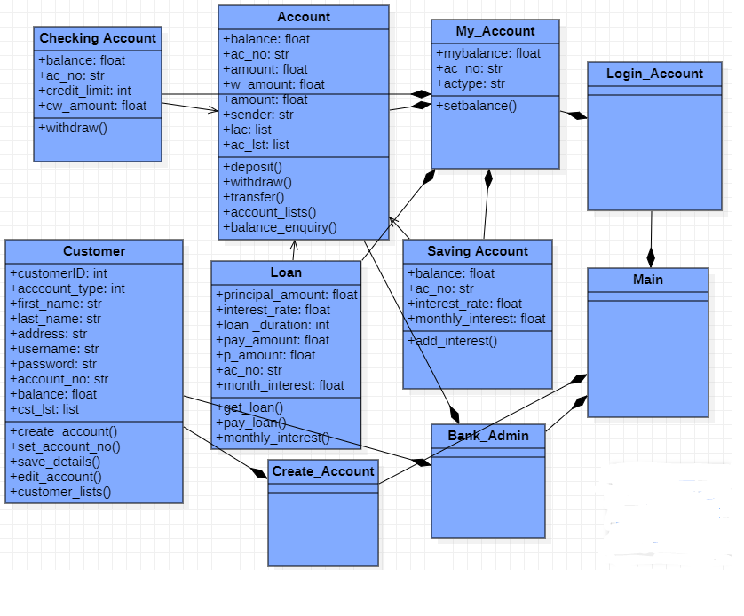

# Online-Banking-System
 

This is a simple online banking system created using Python Object Oriented Programming concept. **Users** can hold different types of accounts as offered by the bank. The **customers** can perform operations according to the account type; e.g. **deposit**, **withdraw**, **balance inquiry**, and **transferring funds**. The **banking system** can **create new accounts** and **manages the accounts**. Both the administrator and the customer **can print reports** on current account details. 
   

## Class Diagram 
 

   

## Distinguishing Features
 

* In Saving Account, the interest adds every month automatically by the use of time module. 
* Efficiently used  CSV files, for store customer details and account details. 
* If a user creates a new account, a account number would generate automatically.
  

## OOP Features Implemented
 

* Multilevel Inheritance 
* Method overriding
* Composition 
* Exception Handling 
  

## Most Challenging Part While Working On Project 
 

* It was very hard to search and edit an account of the file because when writing in TXT file, the accounts are being erased due ‘w’ option, so we overcome it by using the CSV file. 
* At first, it was hard to split the project among the members as the individual cannot work on their own simultaneously because of inheritance and other OOP concepts so once a member finished, we upload it to the other and he/she works from that instance. 
* In Saving Account, we couldn’t update the balance with interest if the account the balance lasted for a month, so we had use of time module and auto updating of interest was made. 
* In real time, if we deposit and started to withdraw, the code raised error saying no required balance, the file wasn’t updated on run time and then we made sure how to correct this by closing the file each and every time after being updated. 
* Some members had issue with OOP concepts at the start, but as soon as the project reached the mid likely every member had the chance of studying the concept clearly.
  

## New Thing Learned While Working On Project 
 
 
* Before learning the concepts of OOP, we had used procedural programming and made different .py files for every classes and then we imported each and every .py files to an interface and we had to run. But after these we shrinked the 1500 lines of code to just 700 lines and also, we implemented every code on the same .py file and we just used a simple function for interface to call. 
* We learned the syntax of Multiple Inheritance, Multilevel Inheritance, Association, Abstract classes and Exception Handling. 
* As use of Exception Handling, we could identify the errors caused and it was very easy for us to address the problem and it save the time.
  

## Future Expansions 
 

* Use GUI to improve Interface.
* Make a Web Application.
• Create Extra classes to increase functionality of the System.
   

